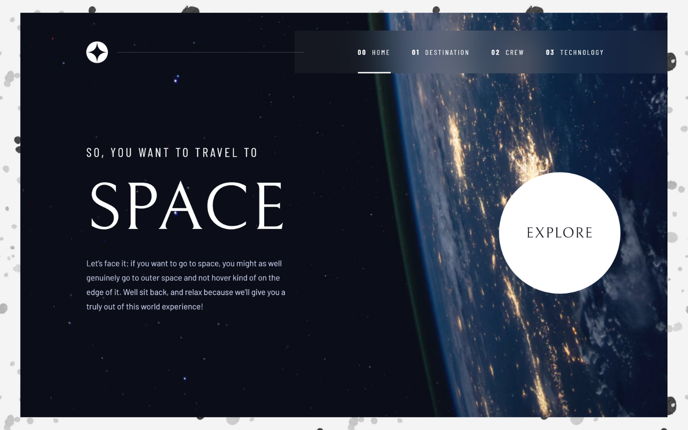
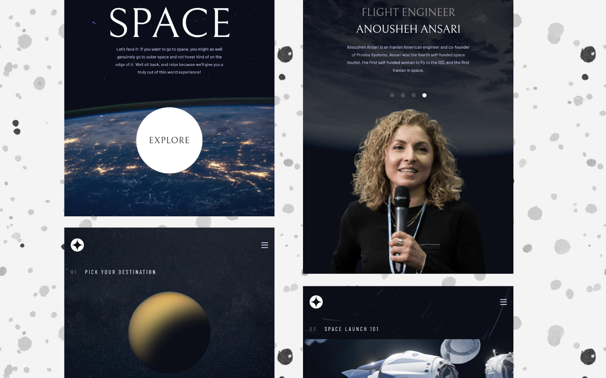
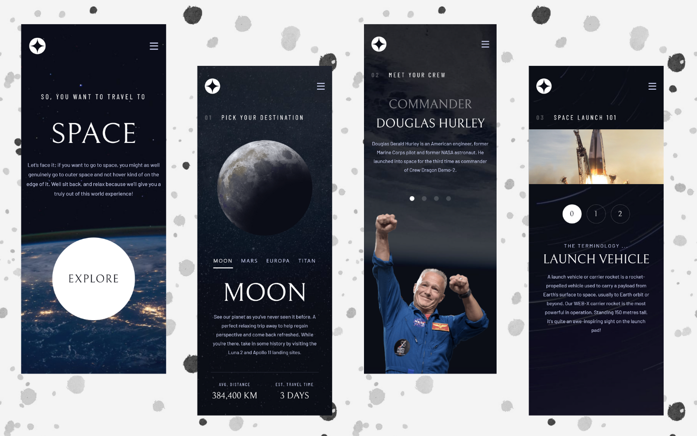

<h2>About the project</h2>

<b>Space Tourism</b> is just a fun project that i made to practice my React knowledge. 

👉 Live Demo: <a href='https://space-tourism-website-irinakruglova.vercel.app/'>Space Tourism Demo</a>

<h3>Build with:</h3>

» React JS  
» SASS  

 

<h2>Screenshots of the Project</h2>
 
<h3 align='center'>Desktop</h3>

 
<h3 align='center'>Tablet</h3>

 
<h3 align='center'>Mobile</h3>

